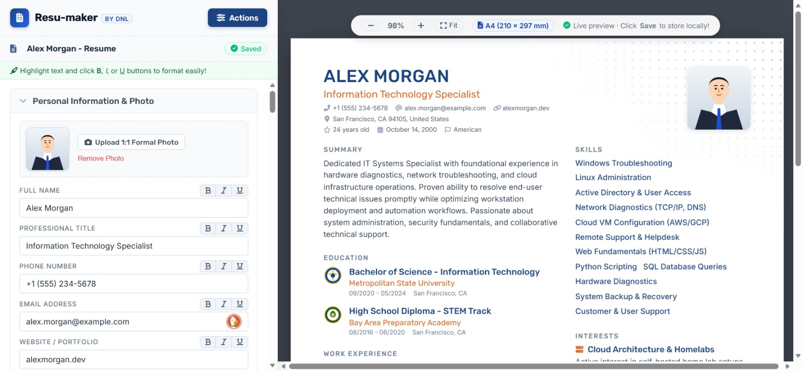

# Resu-maker `by DNL`

A simple, lightweight single-page resume maker created for IT students, beginners, and tech professionals looking for a clean and straightforward resume layout.

---

**Resu-maker Homepage/Editor**

## 📌 About

**Resu-maker by DNL** is a simple, browser-based resume editor. It is designed to help you create a single-page A4 resume without complicated tools or subscriptions. 

If you like a clean, practical layout where everything fits onto one page, this editor is built for that format.

---

## 🎯 Layout & Design

The resume layout is structured simply and practically:

* **Header:** Full name, professional title, contact details, and an optional 1:1 formal photo.
* **Summary:** A short introduction to describe your background and career goals.
* **Left Column:**
  * **Education:** School name, degree, dates, location, and school logo.
  * **Work & Volunteering:** Roles, organizations, dates, location, logo, and bulleted descriptions.
* **Right Column:**
  * **Certifications & Training:** Courses, certificates, and dates.
  * **Technical Skills:** Categorized skills (languages, frameworks, tools, databases).
  * **Projects:** Project titles, descriptions, badges, and project links.
  * **Interests:** List of personal or professional interests.
* **Certification & Signature:** A brief certification statement with your uploaded digital signature.

---

## ✨ Basic Functions

* **Live Preview:** See changes in real-time as you fill out the editor form.
* **Auto-Save:** Saves your changes locally in your browser (IndexedDB & LocalStorage), with a real-time status indicator.
* **Text Formatting:** Quick buttons to format text with **bold**, *italics*, or <u>underline</u>.
* **Photo & Signature Upload:** Add a formal photo, upload a digital signature, and adjust signature size and positioning.
* **JSON Backup & Restore:** Export your resume data to a `.json` file to back it up or transfer it to another computer.
* **PDF Export:** Print or save directly to PDF using your browser's print dialog.
* **Blank & Sample Templates:** Reset to a blank template with guide placeholders or restore sample data anytime.

---

## 📄 How to Save as PDF

1. Click **Menu** > **Save as PDF** (or press `Ctrl + P`).
2. Set **Destination:** `Save as PDF`.
3. Set **Paper size:** `A4`.
4. Set **Margins:** `None` (or `Default`).
5. Set **Options:** Check the box for **`Background graphics`**.
6. Click **Save**.

---

## 👤 Author

* **Created by:** DNL
* **Project:** Resu-maker
