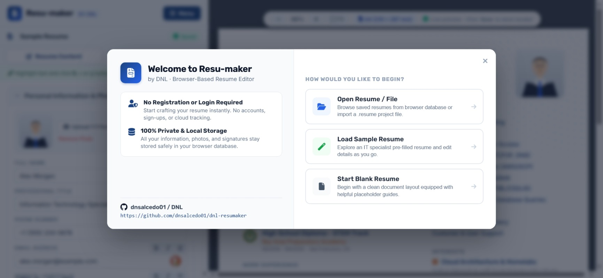
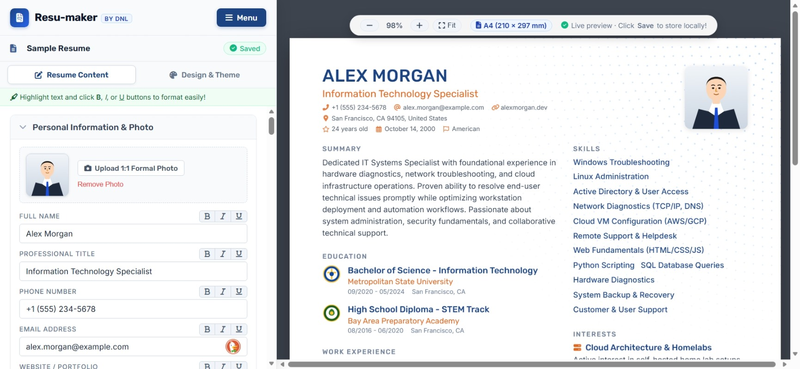

# Resu-maker `by DNL`

**Resu-maker Welcome Onboarding**

**Resu-maker Homepage/Editor**

A simple, lightweight single-page resume maker created for IT students, beginners, and tech professionals looking for a clean and straightforward resume layout.

---

## 📌 About

**Resu-maker by DNL** is a simple, browser-based resume editor designed to help you build a clean, single-page A4 resume without complicated tools or subscriptions.

* **No Login or Registration Required:** Resu-maker runs directly in your browser. There is no account creation, tracking, or cloud lock-in.
* **100% Local & Private:** All your resume information, uploaded photos, and digital signatures are saved locally in your browser's database (IndexedDB & LocalStorage). Nothing is transmitted to external servers.

---

## 🎯 Layout & Design

The resume layout is structured simply and practically:

* **Header:** Full name, professional title, contact details, and an optional 1:1 formal photo.
* **Summary:** A short introduction to describe your background and career goals.
* **Left Column:**
  * **Education:** School name, degree, dates, location, and school logo.
  * **Work & Volunteering:** Roles, organizations, dates, location, logo, and bulleted descriptions.
* **Right Column:**
  * **Certifications & Training:** Courses, certificates, and dates.
  * **Technical Skills:** Categorized skills (languages, frameworks, tools, databases).
  * **Projects:** Project titles, descriptions, badges, and project links.
  * **Interests:** List of personal or professional interests.
* **Certification & Signature:** A brief certification statement with your uploaded digital signature.

---

## ✨ Basic Functions

* **Live Preview:** See changes in real-time as you fill out the editor form.
* **Auto-Save & Local Database:** Automatically saves and catalogs multiple resumes locally in your browser (IndexedDB & LocalStorage).
* **Text Formatting:** Quick buttons to format text with **bold**, *italics*, or <u>underline</u>.
* **Photo & Signature Upload:** Add a formal 1:1 photo, upload a digital signature, and adjust signature size and positioning with natural overlap.
* **Curated Color Palettes:** Choose from 4 high-contrast, paper-legible palettes (Classic Navy & Amber, Forest Emerald & Teal, Executive Burgundy & Bronze, Modern Graphite & Slate) that harmonize headings, accents, icons, and background patterns.
* **Selectable Header Patterns:** Choose between 3 original clean-room vector graphics (Concentric Dots, Honeycomb, Wavy Curves) or a plain minimalist layout.
* **.resume Project Backup & Restore:** Export full resume project data to a `.resume` file (or import `.resume`/`.json` files) to easily transfer between computers.
* **Standalone PDF View:** Open your resume in a dedicated distraction-free browser window configured with exact A4 dimensions and quick print access.
* **PDF Export:** Print or save directly to PDF using your browser's print dialog.
* **Blank & Sample Templates:** Start fresh with a clean blank template with guide placeholders or restore the sample template anytime.

---

## 📄 How to Save as PDF

1. Click **Menu** > **Save as PDF** (or press `Ctrl + P`).
2. Set **Destination:** `Save as PDF`.
3. Set **Paper size:** `A4`.
4. Set **Margins:** `None` (or `Default`).
5. Set **Options:** Check the box for **`Background graphics`**.
6. Click **Save**.

---

## 👤 Author

* **Created by:** DNL
* **Project:** Resu-maker

---

## ⚖️ Disclaimer

**Resu-maker by DNL** is an open-source educational portfolio project.

* **Original Assets:** Background patterns and UI graphics are original vector designs created for this project.
* **Trademarks:** Any brand names or logos shown in sample templates belong to their respective owners and are used solely for demonstration.
* **Fair Use:** Distributed in good faith for personal and educational use. For inquiries, please open an Issue.
